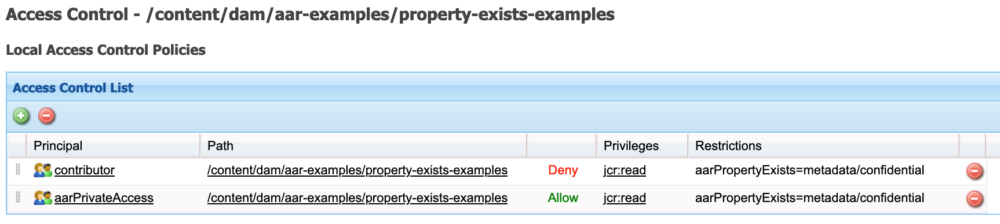
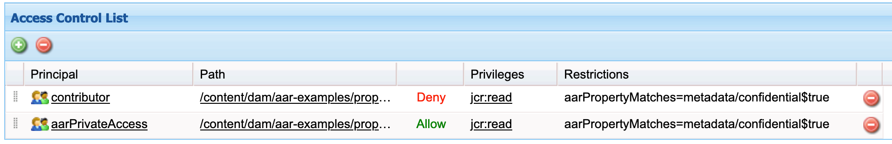
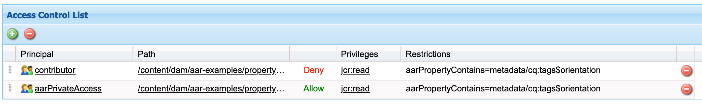
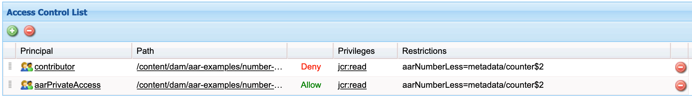
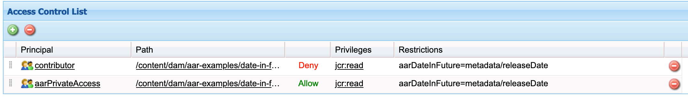
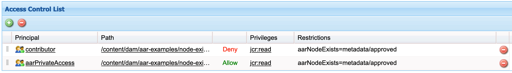
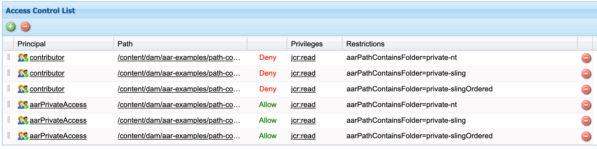

# AEM Advanced Restrictions

This tool adds new restriction types to AEM. These allow to define ACLs based on property values for assets and pages or path names.
There are various use-cases for such property-based ACLs, e.g.:
* Hide confidential assets marked by property or inside folder with defined name
* Prevent publishing of unapproved pages
* Prevent publishing of incomplete assets
* Prevent access to assets before or after a given date

The tool was presented at the [adaptTo() conference in Berlin](https://adapt.to/2024/schedule/unveiling-the-power-of-aems-permission-system). You can get the slides there and also see the video here:

[](https://www.youtube.com/watch?v=OQgN2Nb3p9Q "AECU @ adaptTo() 2018")

Table of contents
1. [Requirements](#requirements)
1. [Installation](#installation)
1. [Restrictions](#restrictions)
   1. [Property Equality Matching](#aarPropertyMatches)
   1. [Property Substring Matching](#aarPropertyStartsWith)
   1. [Property Existence](#aarPropertyExists)
   1. [Number Comparison](#aarNumber)
   1. [Date Comparison](#aarDate)
   1. [Node Existence](#aarNodeExists)
   1. [Folder Naming](#aarPathContainsFolder)
1. [Examples](#examples)
1. [License](#license)
1. [Developers](#developers)

<a name="requirements"></a>

## Requirements

The following AEM versions are supported:
* AEM 6.5.15 and later
* AEM Cloud

<a name="installation"></a>

## Installation

Please install the aem-advanced-restrictions.all package from
[Maven Central](https://repo1.maven.org/maven2/com/ibm/aem/aem-advanced-restrictions/aem-advanced-restrictions.all/)
or our [releases section](https://github.com/IBM/aem-advanced-restrictions/releases) on your AEM instance.
This will install the bundle that provides the new restrictions.

To embed the package in your "all" package please use the following dependency.

```
<dependency>
    <groupId>com.ibm.aem.aem-advanced-restrictions</groupId>
    <artifactId>aem-advanced-restrictions.all</artifactId>
    <version>LATEST</version>
    <type>zip</type>
</dependency>
```

<a name="restrictions"></a>

## Restrictions

All restrictions are evaluated relative to the jcr:content node. Assets (dam:Asset) and pages (cq:Page) are supported. Nodes with other jcr:primaryType are not supported and ignored.
See below for all supported restrictions.

There exist hierarchical and non-hierarchical versions of the property restrictions.
This is caused by a speciality of OAK that allows access to child nodes even
if the parent node is forbidden. For property checks on assets and leaf pages you
can use the non-hierarchical versions. If the checked properties are on folders or
parent pages then use the hierarchical version.

Properties on subnodes of jcr:content:

The property names can include slashes to specify subnodes. This is very useful for assets where most
properties are located in the metadata node.
E.g. to specify "myProperty" on subnode "metadata" you can use "metadata/myProperty".

Example for hiding assets that have a confidential property:

All members of "contributor" are denied access if assets have a metadata property called "confidential".
Only members of "aarPrivateAccess" are allowed to see these assets.



ACLs with restrictions can be set e.g. via CRXDE Lite (Access control tab),
[RepoInit](https://sling.apache.org/documentation/bundles/repository-initialization.html)
or [permissions tool](http://localhost:4502/security/permissions.html).

Remember that the last matching rule wins.
Therefore, deny rules should always be on the top where allow rules should be on the bottom.

<a name="aarPropertyMatches"></a>

### Property Equality Matching

This restriction checks if a given property value matches the restriction value.
The comparison is done by reading the String value. Non-string properties are compared using their String representation.
If the property is not present then the ACL will not apply.

Syntax:
* **aarPropertyMatches** NAME$VALUE
* **aarPropertyMatchesHierarchical** NAME$VALUE

Examples for asset/page property check:

```
aarPropertyMatches confidential$true
aarPropertyMatches metadata/confidential$true
```


Examples for directory/page incl. subpages property check:

```
aarPropertyMatchesHierarchical confidential$true
aarPropertyMatchesHierarchical metadata/confidential$true
```

<a name="aarPropertyStartsWith"></a>

### Property Substring Matching

This restriction checks if a given property value contains the restriction value.
The comparison is done by reading the string value. Non-string properties are compared using their string representation.
You can check for string starts with, ends with and contains.
If the property is not present then the ACL will not apply.

These restrictions are e.g. useful for matching parts of tag values.

Syntax:

* **aarPropertyStartsWith** NAME$VALUE
* **aarPropertyStartsWithHierarchical** NAME$VALUE
* **aarPropertyEndsWith** NAME$VALUE
* **aarPropertyEndsWithHierarchical** NAME$VALUE
* **aarPropertyContains** NAME$VALUE
* **aarPropertyContainsHierarchical** NAME$VALUE

Examples for asset/page property check:
```
aarPropertyStartsWith cq:tags$properties:Confidential
aarPropertyEndsWith metadata/cq:tags$properties:Confidential
aarPropertyContains metadata/subnode/tags$properties:Confidential
```

Examples for directory/page incl. subpages property check:
```
aarPropertyStartsWithHierarchical cq:tags$properties:Confidential
aarPropertyEndsWithHierarchical metadata/cq:tags$properties:Confidential
aarPropertyContainsHierarchical metadata/subnode/tags$properties:Confidential
```



<a name="aarPropertyExists"></a>

### Property Existence

This restriction checks if a given property exists or does not exist under jcr:content.

Syntax:

* **aarPropertyExists** NAME
* **aarPropertyExistsHierarchical** NAME
* **aarPropertyNotExists** NAME

Examples for asset/page property check:
```
aarPropertyExists confidential
aarPropertyNotExists metadata/approved
```

Examples for directory/page incl. subpages property check:
```
aarPropertyExistsHierarchical confidential
```


<a name="aarNumber"></a>

### Number Comparison

These restrictions should only be used for numeric values of type "Long".



#### Less Than

Checks if the property value is less than the restriction value.
If the property is not present then the ACL will not apply.

Syntax:

* **aarNumberLess** NAME$VALUE
* **aarNumberLessHierarchical** NAME$VALUE

Examples for asset/page property check:
```
aarNumberLess counter$5
aarNumberLess metadata/counter$5
```
Examples for directory/page incl. subpages property check:

```
aarNumberLessHierarchical counter$5
aarNumberLessHierarchical metadata/counter$5
```

This matches if the property is less than 5.

#### Greater Than

Checks if the property value is greater than the restriction value.
If the property is not present then the ACL will not apply.

Syntax:
* **aarNumberGreater** NAME$VALUE
* **aarNumberGreaterHierarchical** NAME$VALUE

Examples for asset/page property check:
```
aarNumberGreater counter$5
aarNumberGreater metadata/counter$5
```
Examples for directory/page incl. subpages property check:

```
aarNumberGreaterHierarchical counter$5
aarNumberGreaterHierarchical metadata/counter$5
```

This matches if the property is greater than 5.

<a name="aarDate"></a>

### Date Comparison

These restrictions should only be used for date values.



#### Future

Checks if the property value is in the future (compared to now).
If the property is not present then the ACL will not apply.

Syntax:
* **aarDateInFuture** NAME
* **aarDateInFutureHierarchical** NAME

Examples for asset/page property check:

Use "releaseDate" to store the date when content gets public.
Then add a deny rule for read access for normal editors.
Privileged editors can have an additional allow rule to gain access (this rule must be below the deny rule).

```
aarDateInFuture releaseDate
aarDateInFuture metadata/releaseDate
```

Examples for directory/page incl. subpages property check:

```
aarDateInFutureHierarchical releaseDate
aarDateInFutureHierarchical metadata/releaseDate
```

#### Past

Checks if the property value is in the past (compared to now).
If the property is not present then the ACL will not apply.

Syntax:
* **aarDateInPast** NAME
* **aarDateInPastHierarchical** NAME

Examples for asset/page property check:

Use "releaseDate" to store the date when content gets outdated and should be hidden.
Then add a deny rule for read access for normal editors.
Privileged editors can have an additional allow rule to gain access (this rule must be below the deny rule).

```
aarDateInPast releaseDate
aarDateInPast metadata/releaseDate
```

Examples for directory/page incl. subpages property check:

```
aarDateInPastHierarchical releaseDate
aarDateInPastHierarchical metadata/releaseDate
```

<a name="aarNodeExists"></a>

### Node Existence

This restriction checks if a given node name exists or does not exist under jcr:content.

Syntax:

**aarNodeExists** NAME

**aarNodeNotExists** NAME

Example:
```
aarNodeExists approvers
aarNodeNotExists metadata/approvers
```



<a name="aarPathContainsFolder"></a>

### Folder Naming

This restriction checks if the node is located within a folder with a given name. The folder itself also matches.
In contrast to "rep:subtrees" this restriction only matches real folders and not property names in path.

Folders are detected by checking jcr:primaryType against nt:folder, sling:Folder and sling:orderedFolder. Others are ignored to make sure there are no same-naming conflicts.

Syntax:
**aarPathContainsFolder** NAME

Example:
```
aarPathContainsFolder confidential
```

This will match e.g.:
* /content/dam/site/confidential
* /content/dam/site/confidential/myAsset

but not
* /content/dam/site/public/myAsset/jcr:content/confidential



<a name="examples"></a>

## Examples

You can install our example package. This includes pre-defined
users, groups and assets + pages to demonstrate the functionality.

All test users have user name = password. You can also impersonate from admin for fast switching.
The user "aarRestrictedUser" will only see the public files
in the example paths below. You can use the user "aarPrivateAccessUser" to see the private files.

Check the ACL entries on the folders below to see how it is configured.

Property match:

http://localhost:4502/assets.html/content/dam/aar-examples/property-match-examples

Property substring matching:

http://localhost:4502/assets.html/content/dam/aar-examples/property-starts-with-examples

http://localhost:4502/assets.html/content/dam/aar-examples/property-ends-with-examples

http://localhost:4502/assets.html/content/dam/aar-examples/property-contains-examples

Property existence:

http://localhost:4502/assets.html/content/dam/aar-examples/property-exists-examples

http://localhost:4502/assets.html/content/dam/aar-examples/property-not-exists-examples

Number comparison:

http://localhost:4502/assets.html/content/dam/aar-examples/number-less-examples

http://localhost:4502/assets.html/content/dam/aar-examples/number-greater-examples

Date comparison:

http://localhost:4502/assets.html/content/dam/aar-examples/date-in-past-examples

http://localhost:4502/assets.html/content/dam/aar-examples/date-in-future-examples

Node existence:

http://localhost:4502/assets.html/content/dam/aar-examples/node-exists-examples

http://localhost:4502/assets.html/content/dam/aar-examples/node-not-exists-examples

Folder naming:

http://localhost:4502/assets.html/content/dam/aar-examples/path-contains-folder-examples

<a name="license"></a>

## License

The software is licensed under the [MIT license](LICENSE).

<a name="developers"></a>

## Developers

[Developers area](docs/developers.md)
